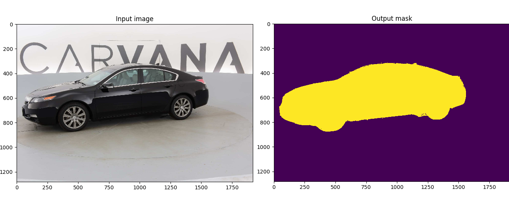

# CIMC项目
CIMC是使用Unet网络结构作为基础，使用pytorch框架，涉及training和inference全过程。   

Customized implementation of the [U-Net](https://arxiv.org/abs/1505.04597) in PyTorch for Kaggle's [Carvana Image Masking Challenge](https://www.kaggle.com/c/carvana-image-masking-challenge) from high definition images.    

This model was trained from scratch with 5000 images (no data augmentation) and scored a [dice coefficient](https://en.wikipedia.org/wiki/S%C3%B8rensen%E2%80%93Dice_coefficient) of 0.988423 (511 out of 735) on over 100k test images. This score could be improved with more training, data augmentation, fine tuning, playing with CRF post-processing, and applying more weights on the edges of the masks.   

   
效果演示

Original paper by Olaf Ronneberger, Philipp Fischer, Thomas Brox: [https://arxiv.org/abs/1505.04597](https://arxiv.org/abs/1505.04597)


### 目录介绍
* checkpoints——        模型权重保存目录
* deploy——            推理模型代码目录
* imgs——             存放一些图片，用于在Readme中显示
* predict.py——         预测代码（一.5中的代码）
* requirements.txt——     环境列表
* unet——             unet模型代码
* data——             数据存放位置
* dice_loss.py——        dice距离
* LICENSE ——          证书
* runs——             tensorboard日志保存目录
* utils——             代码工具目录
* eval.py——           predict引用代码
* train.py——          训练代码


## 一、训练

### 1、环境准备
* CUDA 10.0
* pytorch 1.5
具体看[requirements.txt](requirements.txt)

### 2、数据准备
官网地址：The Carvana data is available on the [Kaggle website](https://www.kaggle.com/c/carvana-image-masking-challenge/data).   
百度云：链接:https://pan.baidu.com/s/1Z7WnSMjpMCGG7q9HH5LViQ  密码:uzv5  

### 3、训练
```shell script
> python train.py -h
usage: train.py [-h] [-e E] [-b [B]] [-l [LR]] [-f LOAD] [-s SCALE] [-v VAL]

Train the UNet on images and target masks

optional arguments:
  -h, --help            show this help message and exit
  -e E, --epochs E      Number of epochs (default: 5)
  -b [B], --batch-size [B]
                        Batch size (default: 1)
  -l [LR], --learning-rate [LR]
                        Learning rate (default: 0.1)
  -f LOAD, --load LOAD  Load model from a .pth file (default: False)
  -s SCALE, --scale SCALE
                        Downscaling factor of the images (default: 0.5)
  -v VAL, --validation VAL
                        Percent of the data that is used as validation (0-100)
                        (default: 15.0)

```
By default, the `scale` is 0.5, so if you wish to obtain better results (but use more memory), set it to 1.

The input images and target masks should be in the `data/imgs` and `data/masks` folders respectively. 

例如：`CIMC# python train.py -f checkpoints/CP_epoch100.pth -b 4`

训练完成后，模型保存到checkpoints目录, tensorboard日志保存在runs中。

### 4、Tensorboard
You can visualize in real time the train and test losses, the weights and gradients, along with the model predictions with tensorboard:

`tensorboard --logdir=runs`

You can find a reference training run with the Caravana dataset on [TensorBoard.dev](https://tensorboard.dev/experiment/1m1Ql50MSJixCbG1m9EcDQ/#scalars&_smoothingWeight=0.6) (only scalars are shown currently).

### 5、验证prediction
You can easily test the output masks on your images via the CLI.

To predict a single image and save it:

`python predict.py -i image.jpg -o output.jpg`

To predict a multiple images and show them without saving them:

`python predict.py -i image1.jpg image2.jpg --viz --no-save`

```shell script
> python predict.py -h
usage: predict.py [-h] [--model FILE] --input INPUT [INPUT ...]
                  [--output INPUT [INPUT ...]] [--viz] [--no-save]
                  [--mask-threshold MASK_THRESHOLD] [--scale SCALE]

Predict masks from input images

optional arguments:
  -h, --help            show this help message and exit
  --model FILE, -m FILE
                        Specify the file in which the model is stored
                        (default: MODEL.pth)
  --input INPUT [INPUT ...], -i INPUT [INPUT ...]
                        filenames of input images (default: None)
  --output INPUT [INPUT ...], -o INPUT [INPUT ...]
                        Filenames of ouput images (default: None)
  --viz, -v             Visualize the images as they are processed (default:
                        False)
  --no-save, -n         Do not save the output masks (default: False)
  --mask-threshold MASK_THRESHOLD, -t MASK_THRESHOLD
                        Minimum probability value to consider a mask pixel
                        white (default: 0.5)
  --scale SCALE, -s SCALE
                        Scale factor for the input images (default: 0.5)
```
You can specify which model file to use with `--model MODEL.pth`.


### Notes on memory
The model has be trained from scratch on a GTX970M 3GB.
Predicting images of 1918*1280 takes 1.5GB of memory.
Training takes much approximately 3GB, so if you are a few MB shy of memory, consider turning off all graphical displays.
This assumes you use bilinear up-sampling, and not transposed convolution in the model.


## 二、部署

### 1、使用pytorch推理
#### (1) CPU部署
```python
%%time
result = net(img_tensor)
```
CPU times: user 53.9 s, sys: 15.3 s, total: 1min 9s   
Wall time: 8.79 s
#### （2）GPU部署
```python
%%time
result = net(img_tensor)
```
CPU times: user 22.7 ms, sys: 7.29 ms, total: 30 ms    
Wall time: 29 ms

### 2、使用ONNXRuntime部署
#### 1、Onnxruntime
[inference-onnxruntime.ipynb](inference-onnxruntime.ipynb)   
```python
%%time
result = sess.run([output_name], {input_name: img})
```
CPU times: user 54.6 s, sys: 4.34 s, total: 59 s   
Wall time: 9.8 s

### 2、onnxruntime-gpu

## 参考
* [UNet: semantic segmentation with PyTorch](https://github.com/milesial/Pytorch-UNet)
* [onnx_runtime_examples](https://github.com/CraigANV/onnx_runtime_examples)

